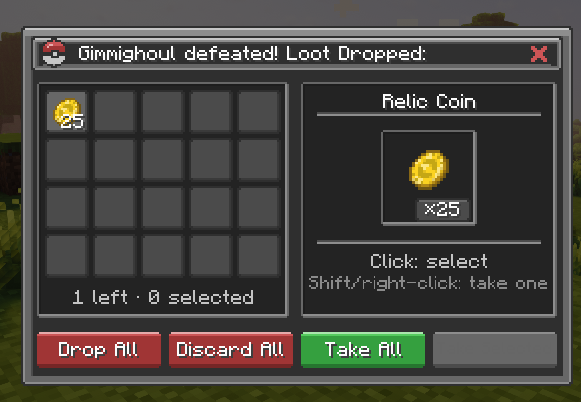
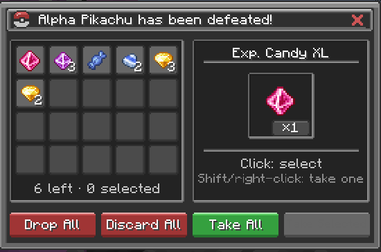
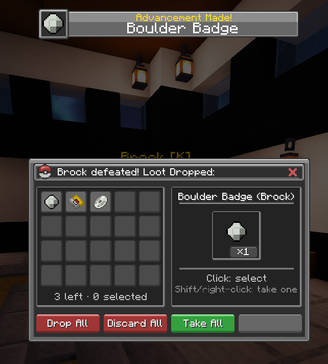
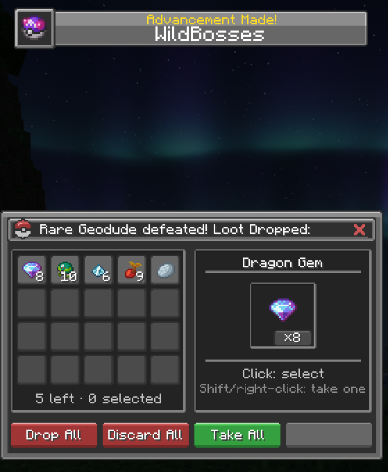

# Cobblemon Loot Menu


*Read this in [English](#english) | Leia em [Português](#português)*

---

## English

### What is it?

**Cobblemon Loot Menu** replaces direct loot drops with a small selection screen.

Current version: **1.0**.

This repository contains the project source and technical overview; installable builds are distributed through GitHub Releases.

Loot stays server-side. The player only chooses what to take, drop, or discard.

It works with regular wild Pokémon and Cobblemon 1.8.1 Alpha Pokémon, with optional integrations for **[WildBosses](https://github.com/arthurc0sme/WildBosses)** and [Radical Cobblemon Trainers](https://modrinth.com/mod/rctmod).

### Screenshots

#### Wild Pokémon Loot

Regular wild Pokémon drops are rolled by Cobblemon and shown in the menu.



#### Alpha Pokémon Loot

Cobblemon 1.8.1 Alpha rewards are caught and merged with the Pokémon's regular species loot into one Alpha loot session. The mod uses the rewards Cobblemon actually spawned instead of rerolling or recreating the Alpha loot tables.

Cobblemon 1.8.1 uses four main Alpha reward level bands: 1-30, 31-50, 51-65, and 66+. EXP Candy scales with the band, stat candies start at level 51, and each type slot gets an independent 50% chance to roll a type reward. Type rewards are weighted 75% toward the matching Type Gem and 25% toward its resistance Berry, with larger quantities from level 51 onward.



#### RCT Mod Integration

Trainer rewards from RCT are caught and routed through the same screen.



#### WildBosses Mod Integration

Boss-tier rewards and the Pokémon's regular species loot are merged into one session.



### Features

- take one stack, selected stacks, or everything;
- drop or discard unresolved loot;
- Esc. and the title-bar X safely use Drop All;
- scrollable grid for more than 20 stacks;
- per-player queue for consecutive rewards;
- timeout and disconnect fallback;
- inventory-overflow notification;
- native Cobblemon 1.8.1 Alpha reward capture;
- optional WildBosses and RCT compatibility;
- public API for other server-side mods.

A single session supports up to **256 non-empty stacks**.

### Controls

- **Left-click** — select or unselect
- **Right-click / Shift + Left-click** — take one stack
- **Take Selected** — take selected stacks
- **Take All** — take everything
- **Drop All** — drop unresolved loot at its origin
- **Discard All** — delete unresolved loot
- **Esc / X** — same as Drop All

### Server-side safety

```text
loot is rolled on the server
    -> a pending session is created
    -> the client receives display copies
    -> the player sends an action and slot indices
    -> the server resolves the real stacks
```

The client never sends item IDs, quantities, or components back to the server.

### Download

Ready-to-use builds are published on **[GitHub Releases](https://github.com/arthurc0sme/cobblemonlootmenu/releases)**.

Download the `.jar` release asset for normal installation. The automatically generated GitHub **Source code** archives are the repository source, not the installable mod.

### Requirements

- Minecraft `1.21.1`
- Java `21`
- Fabric Loader `0.17.2`
- Fabric API `0.116.6+1.21.1`
- Fabric Language Kotlin `1.13.6+kotlin.2.2.20`
- Cobblemon `1.8.1+1.21.1`

Optional:

- WildBosses
- Radical Cobblemon Trainers

### Installation

1. Install Fabric Loader, Fabric API, Fabric Language Kotlin, and Cobblemon.
2. Put the Cobblemon Loot Menu JAR in the `mods` folder.
3. Start the game or server once to generate the config.

### Configuration

The first launch creates:

```text
config/cobblemon-loot-menu/config.json
```

It controls timeouts, queue size, integrations, diagnostic logs, queue indicators, overflow messages, and advanced compatibility timings.

Restart the game or server after changing it.

### Admin commands

```text
/lootmenu test
/lootmenu test <1-256>
/lootmenu pending
/lootmenu compat
```

The default permission level is `2` and can be changed in the config.

### Public API

Other server-side mods can queue loot without accessing internal sessions:

```kotlin
CobblemonLootMenuApi.enqueue(
    LootMenuRequest(
        player = player,
        level = level,
        dropPosition = position,
        title = Component.literal("Quest reward"),
        stacks = rewards,
        sourceId = ResourceLocation.fromNamespaceAndPath("examplemod", "quest")
    )
)
```

All supplied stacks are copied before being stored.

### License

All Rights Reserved. The original, unmodified mod may be used on public or private servers and included in public or private modpacks.

Copying or reusing the mod's source code, assets, textures, artwork, or other content in another project is not permitted without explicit permission. Standalone reuploads, modified public versions, forks, derivative works, and altered binaries also require prior permission.

See [`LICENSE`](LICENSE) for the full terms.

---

## Português

### O que é?

**Cobblemon Loot Menu** substitui o drop direto de loot por uma pequena tela de seleção.

Versão atual: **1.0**.

Este repositório reúne o código-fonte e a visão técnica do projeto; as versões instaláveis são distribuídas pelo GitHub Releases.

Os itens ficam no servidor. O jogador apenas escolhe o que pegar, dropar ou descartar.

O mod funciona com Pokémon selvagens normais e Pokémon Alpha do Cobblemon 1.8.1, com integrações opcionais para **WildBosses** e [Radical Cobblemon Trainers](https://modrinth.com/mod/rctmod).

### Capturas de tela

#### Loot de Pokémon selvagem

Os drops normais de Pokémon selvagens são rolados pelo Cobblemon e exibidos no menu.


#### Loot de Pokémon Alpha

As recompensas de Alpha do Cobblemon 1.8.1 são capturadas e unidas ao loot normal da espécie em uma única sessão de loot Alpha. O mod usa os itens realmente gerados pelo Cobblemon, sem rolar novamente ou recriar as loot tables de Alpha.

O Cobblemon 1.8.1 usa quatro faixas de nível para a recompensa principal de Alpha: 1-30, 31-50, 51-65 e 66+. EXP Candy escala com a faixa, os stat candies começam no nível 51 e cada slot de tipo tem uma chance independente de 50% de gerar uma recompensa de tipo. Essas recompensas têm peso de 75% para a Type Gem correspondente e 25% para a Berry de resistência, com quantidades maiores a partir do nível 51.


#### Integração com o RCT

As recompensas dos treinadores do RCT são capturadas e enviadas para a mesma tela.


#### Integração com o WildBosses

O loot do boss e o drop normal da espécie são unidos em uma única sessão.


### Recursos

- pegar um stack, os selecionados ou todos;
- dropar ou descartar o loot restante;
- Esc. e o X da janela usam Drop All com segurança;
- grade com rolagem para mais de 20 stacks;
- fila individual para recompensas consecutivas;
- fallback em timeout e desconexão;
- aviso quando o inventário está cheio;
- captura nativa das recompensas de Alpha do Cobblemon 1.8.1;
- compatibilidade opcional com WildBosses e RCT;
- API pública para outros mods de servidor.

Uma sessão aceita até **256 stacks não vazios**.

### Controles

- **Clique esquerdo** — seleciona ou remove a seleção
- **Clique direito / Shift + Clique esquerdo** — pega um stack
- **Take Selected** — pega os stacks selecionados
- **Take All** — pega tudo
- **Drop All** — dropa o loot restante na origem
- **Discard All** — apaga o loot restante
- **Esc. / X** — mesmo comportamento de Drop All

### Segurança no servidor

```text
o loot é rolado no servidor
    -> uma sessão pendente é criada
    -> o cliente recebe cópias para exibição
    -> o jogador envia uma ação e índices de slots
    -> o servidor resolve os stacks reais
```

O cliente nunca envia IDs, quantidades ou componentes dos itens de volta ao servidor.

### Download

As versões prontas para uso são publicadas em **[GitHub Releases](https://github.com/arthurc0sme/cobblemonlootmenu/releases)**.

Baixe o arquivo `.jar` anexado à release para instalar o mod. Os arquivos **Source code** gerados automaticamente pelo GitHub contêm o código-fonte do repositório e não são o mod instalável.

### Requisitos

- Minecraft `1.21.1`
- Java `21`
- Fabric Loader `0.17.2`
- Fabric API `0.116.6+1.21.1`
- Fabric Language Kotlin `1.13.6+kotlin.2.2.20`
- Cobblemon `1.8.1+1.21.1`

Opcionais:

- WildBosses
- Radical Cobblemon Trainers

### Instalação

1. Instale Fabric Loader, Fabric API, Fabric Language Kotlin e Cobblemon.
2. Coloque o JAR do Cobblemon Loot Menu na pasta `mods`.
3. Inicie o jogo ou servidor uma vez para gerar a configuração.

### Configuração

Na primeira inicialização, o mod cria:

```text
config/cobblemon-loot-menu/config.json
```

O arquivo controla timeouts, tamanho da fila, integrações, logs de diagnóstico, indicador da fila, avisos de inventário cheio e tempos avançados de compatibilidade.

Reinicie o jogo ou servidor depois de alterar a configuração.

### Comandos administrativos

```text
/lootmenu test
/lootmenu test <1-256>
/lootmenu pending
/lootmenu compat
```

O nível de permissão padrão é `2` e pode ser alterado na configuração.

### API pública

Outros mods de servidor podem enviar loot para o menu sem acessar as sessões internas:

```kotlin
CobblemonLootMenuApi.enqueue(
    LootMenuRequest(
        player = player,
        level = level,
        dropPosition = position,
        title = Component.literal("Quest reward"),
        stacks = rewards,
        sourceId = ResourceLocation.fromNamespaceAndPath("examplemod", "quest")
    )
)
```

Todos os stacks são copiados antes de serem armazenados.

### Licença

Todos os direitos reservados. O mod original e sem modificações pode ser usado em servidores públicos ou privados e incluído em modpacks públicos ou privados.

Não é permitido copiar ou reutilizar o código-fonte, assets, texturas, arte ou outros conteúdos do mod em outro projeto sem permissão explícita. Reuploads separados, versões públicas modificadas, forks, trabalhos derivados e binários alterados também exigem autorização prévia.

Consulte [`LICENSE`](LICENSE) para os termos completos.
